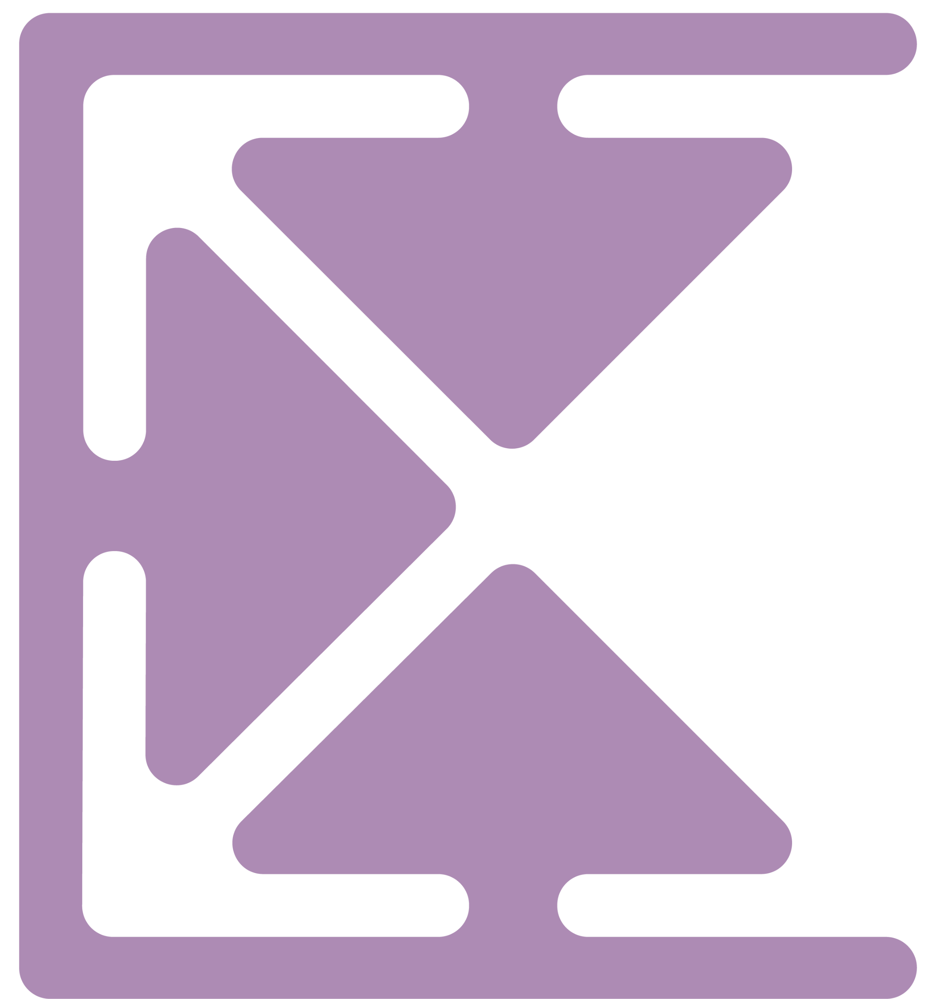

#  Controllo

Controllo is a free browser extension to track all your subscriptions in one place.

## Features

- ✅ Add, edit and delete your subscriptions
- ✅ Set the name, how much you pay, the payment frecuency and the date of the next payment of each subscription
- ✅ Color code to alert how much time is left for the next payment date:
  - 🟥 Red if less than 7 days left
  - 🟨 Yellow if less than 30 days left
  - 🟩 Green if there are more than 30 days

## Where you can download it?

- 🎁 [Chrome, Opera and Brave](https://chrome.google.com/webstore/detail/controllo/bodddijlpmhpjplaajoigmejoglnjhif)
- 🎁 [Firefox](https://addons.mozilla.org/es/firefox/addon/controllo/)
- 🎁 [Edge](https://microsoftedge.microsoft.com/addons/detail/controllo/hepodmbgelammobllblgaindjhahghgj)

## How to support this project?

You can support Controllo by:

1. Leaving a star on this repo
2. Rating the extension on the [Chrome Web Store](https://chrome.google.com/webstore/detail/controllo/bodddijlpmhpjplaajoigmejoglnjhif), [Firefox Browser Add-Ons](https://addons.mozilla.org/es/firefox/addon/controllo/) and [Edge Plugins](https://microsoftedge.microsoft.com/addons/detail/controllo/hepodmbgelammobllblgaindjhahghgj)
3. Sharing the extension with others

Thank you!

## Contributions

Suggestions and pull requests are welcomed! Please read the [CONTRIBUTING.md](https://github.com/dlcastillop/controllo/blob/main/CONTRIBUTING.md) file before contributing.
